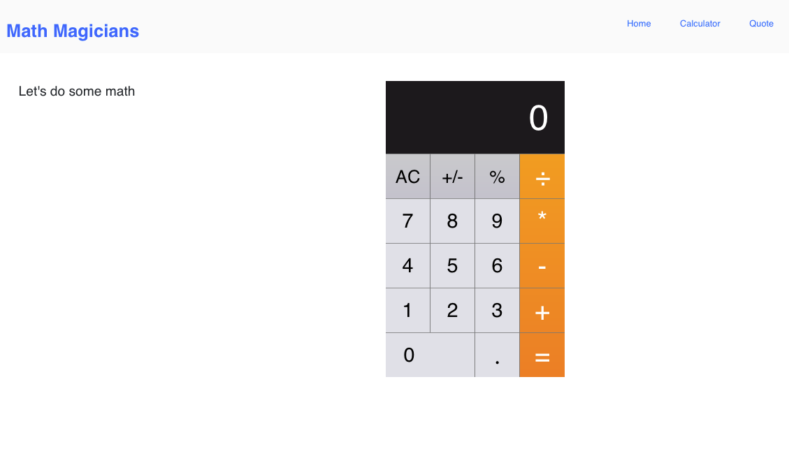

# React Calculator App

> Welcome to my Calculator App project, this is an interactive app excercise from Microverse.




## Built With

- JavaScript + React 

## Getting Started

* You will not need additional instructions on installing Prerequisites.
* In case you have node_modules on your folder Add them to .gitignore file before you a push.

### Prerequisites

* No prerequisites needed for this project.
### Installation

1. Clone the repo
   ```sh
   git clone git@github.com:Richie9000/math-magicians-app.git
   ```
2. Install NPM packages
   ```sh
   npm install
   ```
3. Run the app
   ```sh
   npm start
   ```

### Testing

1. Run the tests
   ```sh
   npm run test
   ```
   or
   ```sh
   npm run watch
   ```
   
### Deploy

Netlify - https://dazzling-ramanujan-5c7372.netlify.app/
Heroku - https://math-magicians-app-heroku.herokuapp.com


👤 **Authors**

Ricardo Rodriguez R.

- Twitter [@R1ck1987] (https://twitter.com/R1ck1987)
- Github [@Richie9000](https://github.com/Richie9000)

Sebastián Muñoz

- GitHub: [@smunozmo](https://github.com/smunozmo)
- Twitter: [@smunozmo](https://twitter.com/smunozmo)


## 🤝 Contributing

Contributions, issues, and feature requests are welcome!

Feel free to check the [issues page](https://github.com/smunozmo/math-magicians-app/issues).


## 👋 Acknowledgements

[Microverse](https://www.microverse.org). 

## Show your support

Give a ⭐️ if you like this project!

